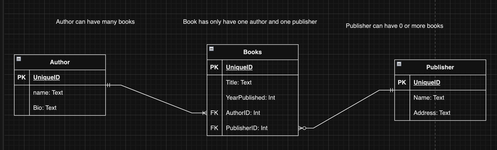

# Database Fundamentals - Part 2

## Introduction

-   We're continuing to explore databases and how to update and modify the data stored in them
-   We're also going to discus schemas and designing them with ERDs (Entity Relationship Diagrams)

## Data Manipulation and Modification

### INSERT INTO statement

-   Purpose: To add new data to a database table.

```sql
INSERT INTO students (id, first_name, last_name, grade)
VALUES (1, 'John', 'Doe', 90),
       (2, 'Jane', 'Doe', 97);

```

### UPDATE statement

-   Purpose: To modify existing data in a database table.

```sql
UPDATE students
SET grade = 95
WHERE id = 1;
```

### DELETE statement

-   Purpose: To remove data from a database table.

```sql
DELETE FROM students
WHERE id = 1;
```

## Database Design and Normalization

### Database schema design

-   Overview: Organizing data into tables and defining relationships.
-   Key Concepts: Tables, columns, and data types.

### Cardinality

-   Explanation: Types of relationships between tables.
-   Types: One-to-One, One-to-Many, Many-to-Many.

### Primary and Foreign Keys

-   Role: Ensuring data integrity and establishing table relationships.

### Normalization: 1NF, 2NF, 3NF

-   Purpose: To reduce redundancy and dependency in data.
-   1NF: It is used to ensure that the data in the database is atomic. Atomic means that each attribute in a table contains only one value. It also means that each row in a table contains only one instance of an entity.
-   2NF: It is used to ensure that the data in the database is in the right place. It is used to ensure that each attribute in a table is dependent on the primary key.
-   3NF: It is used to ensure that the data in the database is not redundant. It is used to ensure that each attribute in a table is dependent on the primary key.

## Codelabs Learning Assistant

> [Codelabs Learning Assistant Demo](https://chatgpt.com/g/g-68484cbcb348819181c3f4137b0b7c49-codelabs-learning-assistant)
>
> -   Show students how to ask the Codelabs Learning Assistant: "What is one way to keep a database secure?"

## Security and Best Practices

### Database Security

-   Importance: Protecting data from unauthorized access and breaches.
-   Measures: Access controls, encryption, and audits.

### Performance Optimization

-   Goal: Enhancing database operation efficiency.
-   Strategies: Indexing and query optimization.

### Database Administration

-   Scope: Managing and maintaining database systems.
-   Responsibilities: Backup, recovery, and performance monitoring.

## Codelabs Learning Assistant

> [Codelabs Learning Assistant Demo](https://chatgpt.com/g/g-68484cbcb348819181c3f4137b0b7c49-codelabs-learning-assistant)
>
> -   Demonstrate for students how to use the Codelabs Learning Assistant for creative exploration: "Can you suggest a real-world scenario where a many-to-many relationship is needed?"

# Live Coding Session

Create a database schema for a library system by first designing an ER diagra, then implementing the schema.

[Drawio](https://app.diagrams.net/)



```sql
CREATE TABLE Authors (
    AuthorID INT PRIMARY KEY,
    Name TEXT,
    Bio TEXT
);

CREATE TABLE Publishers (
    PublisherID INT PRIMARY KEY,
    Name TEXT,
    Address TEXT
);

CREATE TABLE Books (
    BookID INT PRIMARY KEY,
    Title TEXT,
    AuthorID INT,
    PublisherID INT,
    YearPublished INT,
    FOREIGN KEY (AuthorID) REFERENCES Authors(AuthorID),
    FOREIGN KEY (PublisherID) REFERENCES Publishers(PublisherID)
);
```

This schema includes tables for books, authors, and publishers, with foreign keys linking books to their authors and publishers.

Populate the Authors and Publishers tables with data, then add books linking to these tables.

```sql
INSERT INTO Authors (AuthorID, Name, Bio) VALUES (1, 'George Orwell', 'English novelist and essayist...');
INSERT INTO Publishers (PublisherID, Name, Address) VALUES (1, 'Penguin Books', 'London, UK');

INSERT INTO Books (BookID, Title, AuthorID, PublisherID, YearPublished)
VALUES (1, '1984', 1, 1, 1949);
```

Let's update book information based on specific conditions.

```sql
UPDATE Books
SET YearPublished = 1950
WHERE Title = '1984' AND AuthorID = 1;

SELECT * FROM Books;
```

This updates the publication year of '1984' by George Orwell to 1950, demonstrating how to use conditions in an update statement.

To showcase the relationship between books, authors and publishers, let's perform the following query:

```sql
SELECT
    Authors.Name AS AuthorName,
    Publishers.Name AS PublisherName,
    Books.Title,
    Books.YearPublished
FROM
    Books
INNER JOIN Authors ON Books.AuthorID = Authors.AuthorID
INNER JOIN Publishers ON Books.PublisherID = Publishers.PublisherID;
```

Let's now delete records from Books where the publisher is no longer active.

```sql
DELETE FROM Books
WHERE PublisherID IN (SELECT PublisherID FROM Publishers WHERE Name = 'Penguin Books');

This statement deletes books published by 'Penguin Books', showing how to combine DELETE with a subquery.
```

# Any questions?
